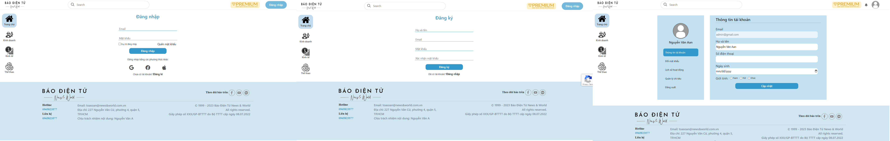
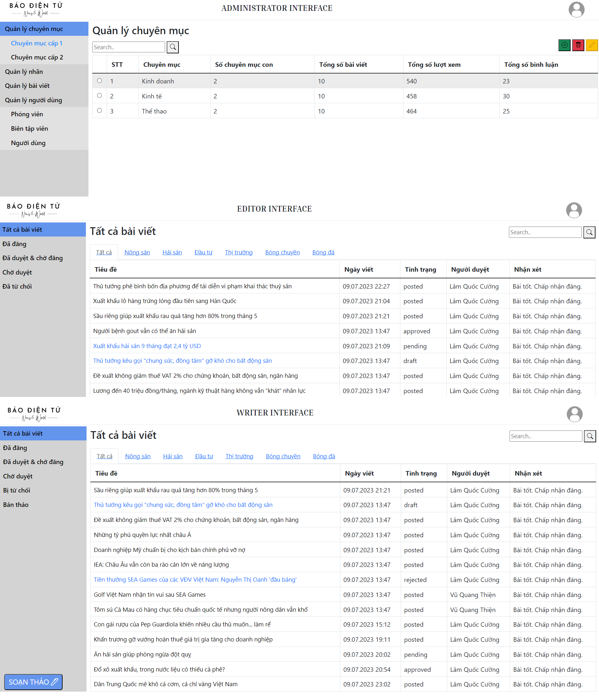
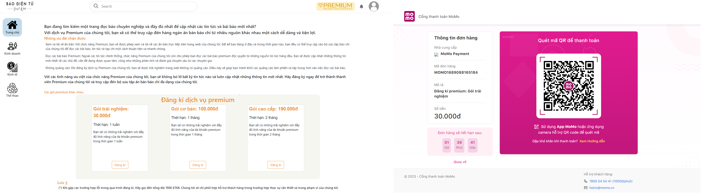

# Phát triển ứng dụng web | Đồ án cuối kì

**Thành viên nhóm:**

-   20120028: Huỳnh Lê An
-   20120561: Từ Văn Quí
-   20120579: Vũ Văn Thái

**Chủ đề:** Website tin tức

-   Yêu cầu: https://hackmd.io/5dYoCeqcTcWxPsUsoK0OBQ?view=

**Công nghệ sử dụng**

-   Framework: NodeJS / ExpressJS
-   DB: Postgres / imgur

**Các tính năng nổi bật**

-   Đăng nhập bằng Google
-   Thanh toán Momo
-   ...

**Giới thiệu về từng phần của website**

-   Đọc tương tác với các bài viết(bình luận, tạo pdf, ...)
-   Quản trị người dùng(writer, editor, premium, default)
-   Quản trị bài viết(bản thảo, chờ duyệt, xuất bản)
-   Truy vấn bài viết(tìm kiếm theo text, theo chuyên mục, theo tag)

**Cấu hình**

-   Yêu cầu thiết bị có cài đặt nodejs
-   Cần cập nhật các giá trị trong biến file `.env`

**Thể hiện chức năng của website**

-   Đường link của website: https://ptudw-20tn-nhom06.onrender.com
    **Một vài hình ảnh nổi bật của website**
-   Về giao diện người dùng:
    -   Trang chủ
        
    -   Người dùng
        
-   Về giao diện quản lý: Sẽ gồm admin, editor, writer
    

**Thanh toán momo**

